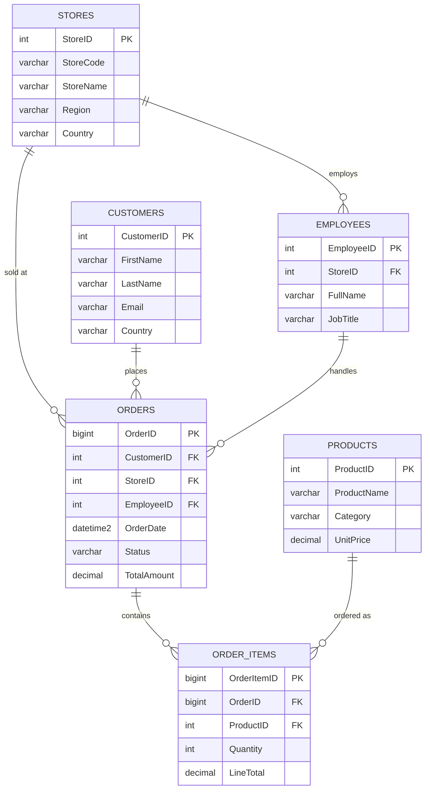

# Mock source schema — `MociSourceDB`

Simulates a retail OLTP source system to be migrated into Databricks via the
Bronze → Silver → Gold medallion pipeline.

## ERD

## Tables

| Table | Type | Approx. rows | Notes |
|---|---|---|---|
| `sales.stores` | small | ~200 | store dimension |
| `sales.products` | small | ~5,000 | product dimension |
| `sales.customers` | small | ~50,000 | customer dimension |
| `sales.employees` | small | ~2,000 | FK → stores |
| `sales.orders` | **huge** | ~5,000,000 | FK → customers/stores/employees |
| `sales.order_items` | **huge** | ~10,000,000 | FK → orders/products |

Every table has `CreatedDate`, `ModifiedDate` (used as the incremental watermark
column by the future Bronze JDBC extractor) and the two fact tables also carry a
`ROWVERSION` column as an alternative/robust CDC-style watermark.

## Setup order

1. `init/01_create_database.sql` — creates `MociSourceDB` (SIMPLE recovery model)
2. `ddl/02_create_schema.sql` — creates the `sales` schema
3. `ddl/03_create_dimension_tables.sql` — small reference tables
4. `ddl/04_create_fact_tables.sql` — huge transactional tables

Data is populated separately by [`scripts/run_mock_data_setup.py`](../scripts/run_mock_data_setup.py)
(dimensions via Faker, facts via set-based batched T-SQL for performance).
